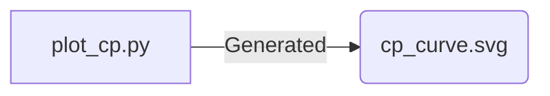
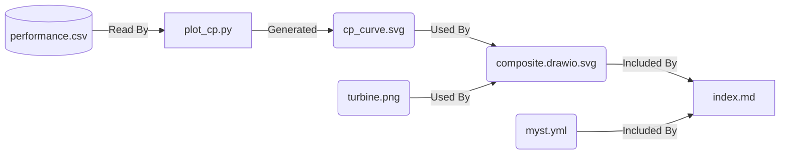

# The MyST plugin

`:::{figmint}` renders a figure together with what is known about it: where each
component came from, whether any of it was machine-generated, and whether the
picture on the page is still consistent with the files behind it.

MyST embeds `figures/composite.drawio.svg` perfectly well on its own. What it
cannot do is answer the questions a reader of a research document actually has.
That information exists — it is in the diagram, in the sidecars, in `calkit.yaml`
and `dvc.lock` — but nothing carried it into the rendered document, so it stopped
at the command line where only the author ever saw it.

```markdown
:::{figmint} figures/composite.drawio.svg
:name: fig-performance
:width: 90%

Left: power coefficient against tip speed ratio. Right: an AI-generated
schematic, imported from outside the project.
:::
```

Which produces the figure, numbered and cross-referenceable exactly as MyST's own
`figure` directive would, followed by a collapsible panel:

| Component | Provenance | Source | In figure | Basis |
| --- | --- | --- | --- | --- |
| `figures/cp_curve.svg` | 🔁 reproducible | ✅ up to date | ✅ matches source | Calkit stage `plot-cp` |
| `figures/turbine.png` | 🔏 signed | — not generated here | ✅ matches source | C2PA credentials verify (Valid) **AI-generated** |

## Why an executable plugin

mystmd supports two kinds of plugin: a JavaScript module, and an *executable* it
spawns and speaks JSON to. This one is executable, and the reason is not
convenience.

A JavaScript plugin would have had to reimplement the draw.io reader, the C2PA
manifest reader, the provenance ladder, and the `dvc.lock` comparison — in a
second language, in a second codebase, kept in step by hand. The first time
`figmint check` and the rendered document disagreed, the panel would become
something you have to verify rather than something you can read.

As an executable it is `figmint.myst`, importing `figmint.report` directly. The
document is built by the same code that answers `figmint check`. They cannot
drift, because there is nothing to drift from.

The cost is a process spawn per directive. For a document with a handful of
figures this is not measurable next to MyST's own build time.

## The protocol

Not documented anywhere I could find; this was read out of the bundled
`myst.cjs` (`loadExecutablePlugin`, `executeSyncParser`).

**Called with no arguments**, print a JSON specification on stdout and exit 0:

```json
{
  "name": "figmint",
  "directives": [
    {
      "name": "figmint",
      "doc": "...",
      "arg": {"type": "string", "required": true},
      "options": {"name": {"type": "string"}, "width": {"type": "string"}},
      "body": {"type": "parsed"}
    }
  ]
}
```

**Called with `--directive <name>`**, read the payload on stdin and write a list
of AST nodes on stdout. Roles and transforms use `--role` and `--transform` the
same way.

A non-zero exit becomes an opaque `Non-zero error code after running executable`
during someone's build, with no stack trace — so the tests exercise the real
entry point via `subprocess`, not just `main()` in-process. A stray `print` to
stdout would corrupt the JSON and fail the same way.

The payload is richer than it first appears:

```json
{
  "arg": "figures/composite.drawio.svg",
  "options": {"name": "fig-performance", "width": "90%"},
  "body": "Left: power coefficient...",
  "node": {"children": [{"type": "mystDirectiveBody", "children": [...]}]}
}
```

`body` is the raw string, but `node.children` contains the body **already
parsed**. Using the parsed form is what keeps emphasis, citations, and
cross-references working inside a caption instead of arriving as literal text.

The working directory is the MyST project root, so a relative path in the
directive argument resolves the same way it does in the markdown.

## What it emits

Plain JSON. The AST helpers in `figmint.myst` are dict constructors named after
the nodes they build, so the rendering code reads as document structure.

The figure is a `container` of kind `figure`, which is exactly what MyST's own
directive produces — the `identifier`/`label` pair is what makes `[](#fig-...)`
resolve and the caption number appear:

```python
{"type": "container", "kind": "figure",
 "identifier": "fig-performance", "label": "fig-performance",
 "children": [{"type": "image", "url": "...", "width": "90%"},
              {"type": "caption", "children": [...]}]}
```

The panel is an `admonition`, `class: dropdown` when nothing is wrong so a long
document does not become a wall of metadata, and expanded and red when it is.

The image URL is left **relative**. MyST resolves and copies the asset itself,
under a content-hashed name; handing it an absolute path breaks that.

## The four questions

The panel keeps apart four things that are easy to conflate, and the value is
mostly in the fact that they can disagree.

1. **Is the component identified well enough to publish?** The provenance ladder
   — `unidentified` < `declared` < `generated` < `reproducible` < `signed` —
   assessed from sidecars, C2PA credentials, and pipeline stages. This is what
   `figmint check` enforces.
2. **Is the embedded copy still the file on disk?** draw.io embeds a *copy* of
   each component with no link back, so a regenerated plot leaves the diagram
   holding a stale duplicate. The "In figure" column.
3. **Is that file itself out of date?** A component can match its file exactly
   while the file is the output of a script that has since been edited. Read from
   `dvc.lock`, which records each dependency's hash as of the last run. The
   "Source" column.
4. **Is the figure behind its own source?** The published `.drawio.svg` is
   rendered from the authored `.drawio`. Edit the diagram and every component is
   still perfectly embedded and perfectly identified — and the picture on the page
   is a rendering of something that no longer exists.

The fourth is the one that took longest to get right, because every check that
looks *inside* a figure is structurally blind to it. It also needs a **transitive**
freshness walk: editing the diagram makes `embed-figure` stale, but
`render-figure` — which produces the published SVG — depends only on an
intermediate that `embed-figure` has not rewritten yet, so in isolation it still
looks current. A stage can only be vouched for if everything behind it can be.

There is a fifth, reported as a warning rather than a failure: an input at the
**root** of the chain that nothing accounts for. See [Input data with no stated
origin](#input-data-with-no-stated-origin).

## Making it live

MyST caches a parsed page against the sha256 of its markdown. Nothing else
invalidates it. So a regenerated component, or a pipeline run, would leave the
panel confidently reporting state that is no longer true — the document rebuilds,
the directive does not re-run.

`figmint watch` closes this. It watches:

- each component file;
- the **declared inputs of the stage that produces each component**, so editing
  `scripts/plot_cp.py` registers even though the script is not in the figure;
- the **document's own dependency chain**, so editing the authored `.drawio`
  registers even though it is not a component of anything;
- `dvc.lock` and `calkit.yaml`, because the verdict is read out of them and
  running the pipeline can flip a stage from stale to current without any
  component byte changing.

On a change it touches the markdown, which invalidates the parse cache. Measured
end to end — file saved to banner changed — **0.66–0.72 s**, in both directions.

This is why the example ships one command. There were briefly two, `serve` and
`preview`, and `serve` was the obvious name for the one that silently lacked the
watcher.

### Live reload stops at the browser

The MyST dev server runs two servers: the app on port 3000, and the content
server on 3100. The theme opens a websocket to **3100** (`/socket`) and reloads on
a `RELOAD` message.

Inside VS Code's Simple Browser that websocket never opens — it is a webview
proxying the one URL it was given, and it does not forward connections to another
port. The content updates server-side and the page never hears about it. Both
servers also bind `[::1]` only, which independently breaks any client resolving
`localhost` to `127.0.0.1`.

Nothing on figmint's side can fix this. Open the preview in a real browser and
live reload works.

## The edit button

The panel offers a way to open the diagram. Getting this to actually work took
three attempts, and the failures are instructive.

**`vscode://file/<path>`** works in Chrome, where the OS hands the URL to VS Code.
It does nothing in Simple Browser, for the same reason live reload does not: a
webview will not follow a non-http scheme. It navigates to the URL and shows a
blank page. Labelling it "external browser only" was honest and useless.

**A markdown link to the source** — the obvious simplification — is worse. MyST
resolves a relative link to a project file by copying it into the build under a
content-hashed name:

```
[edit](figures/composite.drawio)  →  /build/composite-3b92a00d….drawio
```

So clicking hands the reader a *duplicate*. Editing that duplicate is lost work,
and it looks like it worked.

**An HTTP link to a local endpoint** is the one that works. `figmint watch
--open-server` serves a single route on loopback that opens the file in an editor
and answers `204 No Content` — which browsers treat as "stay where you are",
making the link behave like a button instead of navigating away.

Two properties keep this from being a liability:

- It binds `127.0.0.1`, serves exactly one route, and refuses any path outside
  the project. Without that it is an "open anything on this machine" endpoint.
- The plugin emits the link **only** when `FIGMINT_OPEN_URL` is set. A published
  build names the source path as plain text instead, rather than carrying a dead
  link to a port on the author's laptop.

The link also resolves to the **authored** `.drawio` when one sits beside the
rendered `.drawio.svg`. Editing a build artifact works right up until the next
pipeline run overwrites it.

## The provenance graph

With `:graph:` the panel also carries a Mermaid diagram of where the figure came
from:

```markdown
:::{figmint} figures/composite.drawio.svg
:graph: true              # or: data-flow, software-dependencies, full
:graph-detail: medium     # low | medium | high
:::
```



The graph comes from Stencila's SDK, which builds it per asset; figmint merges
the per-component graphs and supplies each `source` from the Calkit stage,
because the SDK does not infer one for a file subject and without it the graph is
three nodes of directory containment.

The *projection* — which relationships each view shows, that `PartOf` is
scaffolding, how nodes are labelled — is ported from Stencila's TypeScript rather
than invented, and the rendering is Mermaid because MyST draws it natively.
`docs/stencila-integration.md` explains why not the Cytoscape component Stencila
ships.

`:graph:` requires the Stencila SDK, which is optional. Without it the panel says
so in one line rather than failing the build or silently omitting the diagram —
a figure with no graph and a figure whose graph could not be built are different
situations.

### Making the graph say anything useful

Two things had to change before the graph was worth showing.

**Static analysis loses the data input.** Stencila derives data flow by reading
the source, and it does that well — `open("data/raw.csv")` produces a
`datatable:data/raw.csv --ReadBy--> code` edge. But it cannot constant-fold
`HERE / "data" / "performance.csv"`, and composing paths like that is ordinary
Python. The example's own script defeats it, so the first graph said "a script
made a picture" while omitting the dataset the picture is *of*.

figmint does not have to infer this. `calkit.yaml` declares the stage's inputs
and outputs and `dvc.lock` records that it ran with them — stronger evidence than
static analysis — so those edges are added directly, as `Declared`.

**Stencila's `data-flow` preset hides datatable nodes** at anything below `high`
detail, and `high` brings symbols (`HERE`, `out`) back as noise. That rule is
right for a document threaded with dataframes, where every intermediate would
swamp the view. It is wrong for a figure, which has one or two inputs and where
the dataset is the most interesting node. So figmint adds a `figure` preset:
`data-flow`'s edge table, without the datatable filter. It leads the `auto`
order.

That is the only place figmint's projection deliberately disagrees with
Stencila's.

## The document's own provenance

`:::{figmint-provenance}` does the same one level up. A published document is a
composite of artifacts in the same sense a figure is, several stages deep:



It discovers every tracked figure under the project root, merges their graphs,
and puts the page above them. Options: `:table:` for a per-figure summary,
`:graph:`, `:graph-detail:`.

**Identifying the page took a detour.** MyST does not tell an executable
directive which file it is in — the payload carries `type`, `name`, `value`,
`position`, and `children`, and nothing else. So the page is found the way the
rest of figmint finds things: by asking the pipeline which stage consumes a
document source. That is the better answer anyway, because it is the *declared*
relationship rather than a filename, and it is exactly the chain the summary
exists to show. An explicit argument overrides it, and ambiguity (two candidate
documents) resolves to nothing rather than a guess.

An authored `.drawio` sitting beside its rendered `.drawio.svg` is skipped: it is
a source, not a published figure, and it is permanently "stale" by design because
it holds the embedded copies from before the last reimport.

## Input data with no stated origin

A figure can be `reproducible` in every component and still rest on a CSV that
appeared in the repository one day.

The plugin walks each component's stage inputs transitively, skips anything
another stage produces, skips the project's own source (scripts, lockfiles), and
reports what is left. A root is accounted for when `calkit.yaml` declares it with
`imported_from` — the same test Calkit's own `calkit check` applies — or when
figmint can account for it from a `.prov.yaml` sidecar or C2PA manifest.

> **Unaccounted input data.** This figure is derived from `data/performance.csv`,
> which no pipeline stage produces and no `imported_from` in calkit.yaml explains.
> Everything above it is reproducible; the chain simply stops here.

A `title` and a `description` do not count. They say what a file is, never where
it came from or how to get it again.

This is deliberately **not** a policy violation and does not fail the build. The
components are identified; what is missing is one link further back, and failing
here would penalise exactly the projects that bothered to adopt a pipeline.

## Design notes worth keeping

Four things that were wrong first, and are worth not repeating.

**"Current" overclaimed.** The freshness column originally read `✅ current`,
meaning the embedded copy matched the file on disk. True, and next to a red
"upstream out of date" banner it reads as a contradiction. It now says
`matches source` — precise about what was actually compared — and the two
freshness questions get their own columns so neither has to imply the other.

**A green tick vouched for a broken row.** Even with the wording fixed, a `✅` in
a row whose provenance is broken reads as "this component is fine". The mark now
tracks whether the component can be *trusted*; the words stay precise about the
comparison. No green survives in a row that is not trustworthy.

**A guard for a bug that did not exist.** On the theory that DVC writes
`dvc.lock` once at the end of a run — so a stage running *inside* that run would
read the previous run's lock — the freshness check treated a lock older than a
stage's outputs as unusable. Sampling `dvc.lock` during `calkit run` showed five
distinct mtimes across five stages: it is written **incrementally**, and the
guard never fired for the case it was written for. It did fire when someone
regenerated an output by hand after editing a script, which is precisely when the
warning is worth having. Removed.

**The wrong build artifact.** `_build/site/content/index.json` is a dev-server
artifact. The published output is `_build/html/`. Diagnosing against the former
produced a confident and completely wrong account of a bug that was not there.

## Limits

- **The verdict is a snapshot.** A published build bakes the panel into HTML,
  correct as of the build. A reader opening the page next week sees the state as
  of the build, not as of their visit. Only the live preview is reactive.
- **The graph is only as good as Stencila's analysis.** For the example figure
  it finds the script, the packages, and the generation edge — but not
  `data/performance.csv`, because nothing in the script's static analysis links
  the read to the output. figmint knows that dependency from `calkit.yaml`, so
  the graph is currently *weaker* than the provenance table beside it. Feeding
  figmint's own edges in is the obvious next step.
- **One directive, no roles or transforms.** A transform could upgrade existing
  `:::{figure}` blocks automatically; a new directive was chosen so that opting
  in is explicit and a plain `figure` still means a plain figure.
- **Executable plugins are spawned per directive invocation.** Fine at this
  scale; a document with hundreds of tracked figures would want a different
  shape.
